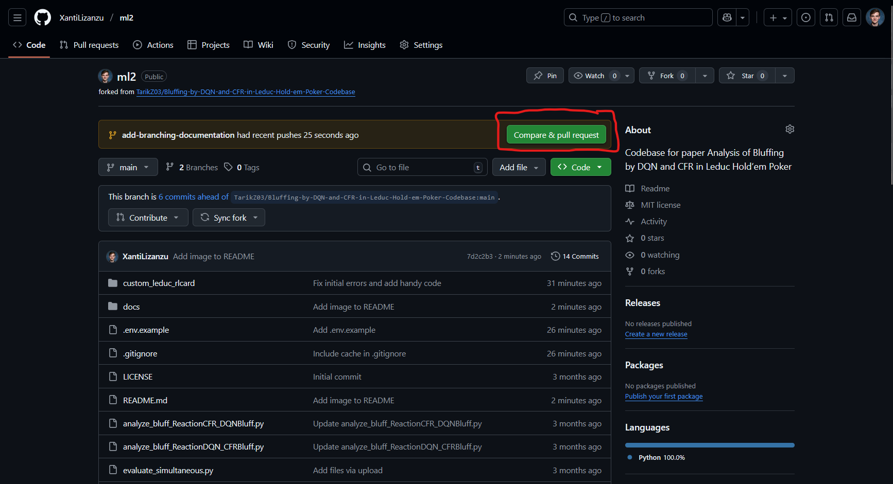

# Installation

To install the project, paste the following commands:

```powershell
> git clone "https://github.com/XantiLizanzu/ml2.git"
> py -3.11 -m venv venv  # build virtual environment with Python 3.11
> .\venv\Scripts\activate
> pip install -r requirements.txt 
```

# Environment

Copy the `.env.example` to a `.env` file:

```powershell
> cp .env.example .env
```

And edit `SAVE_DIR` to match the directory where you want to save the model.

# Run

Run the `simultaneous_training.py` file.

# Edit code

Create a branch from `main` named for what you are doing (e.g. `add-ltsm`) and when you are done and committed all your code create a pull request through GitHub:

